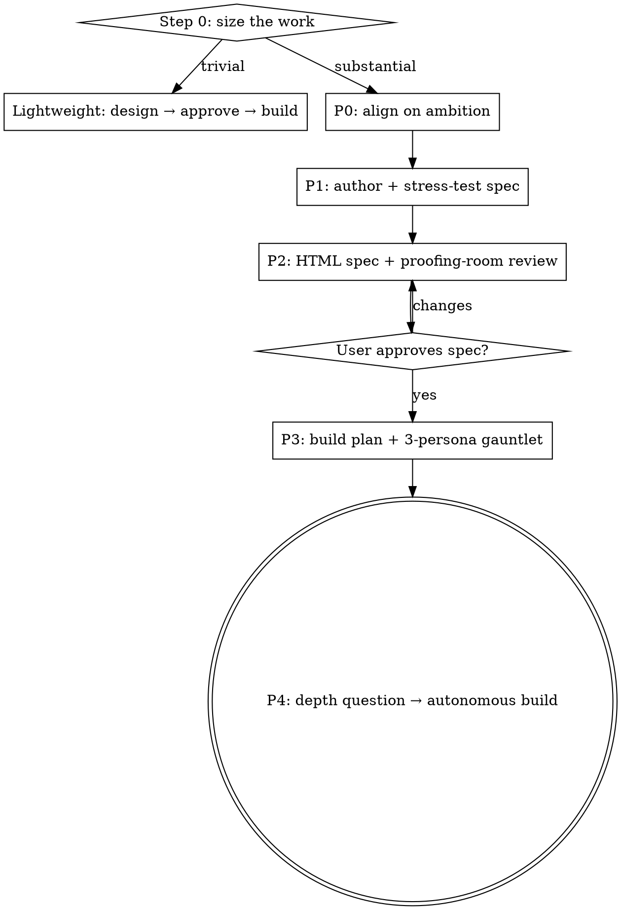

# Brainstorming → Spec → Plan → Build

## Overview

One pipeline from a raw idea to an executed first phase:

1. **Align on the ambition** through real back-and-forth — not a rigid one-question march.
2. **Prove the spec and the plan** with research and adversarial agents *before* committing to either.
3. **Keep the human in the loop** through a readable HTML document they can mark up in place.
4. **Then execute autonomously**, scaled to context budget.

**Core principle:** match the weight of the process to the size of the work. A button-colour change does not get an HTML spec and a three-persona gauntlet; a new subsystem does.

This skill supersedes the pipeline of `superpowers:brainstorming` — if both are offered, use this one.

## The gate

Do NOT write code, scaffold, or invoke an implementation skill until: **(trivial path)** a short design is stated and approved, or **(full path)** the **HTML spec is approved in Phase 2**. Violating the letter of this gate violates its spirit — "the ambition is obvious, I'll just start" is the failure it exists to stop.

## Step 0 — Size the work (always do this first)

**Decision axis:** if the work needs phases/workstreams **OR** touches irreversible surfaces (data, auth, money, external systems) → **full pipeline**. Everything else → **lightweight**, even if it's multi-step.

- **Lightweight path:** brief align (a question or two) → state a short design (a few sentences, or a small step list) → get approval → implement. Done — stop reading here.
- **Full pipeline:** run Phases 0–4 below.
- **When genuinely ambiguous, ask once:** *"This looks substantial — want the full design pipeline (stress-tested spec → HTML review → attacked plan → autonomous build), or keep it lightweight?"*

## Full pipeline

Track each phase as a task and work them in order.

> **Tooling:** Phases 1, 3, and 4 fan out fresh-context subagents via the `Workflow` tool (templates in `workflows.md`). If `Workflow` is unavailable in the session, run the same fan-outs with parallel `Agent`/`Task` subagents — same personas, same schemas. **Don't role-play the personas in your own context** — the adversarial value comes from agents that don't share your assumptions.

### Phase 0 — Align on the ambition

Goal: a shared, crisp picture of *what we're really trying to do and why* — not just a requirements list.

- **Read context first** — relevant files, docs, recent commits. Don't ask what the code can tell you.
- **Have a real conversation, not an interrogation.** Ask 1–3 related questions per turn; go deeper than the surface ask. This is the "longer back-and-forth" — don't rush to "here's the design."
- **Probe the ambition:** the underlying goal, who it's for, what *great* looks like vs merely *done*, the hard constraints (stack, time, budget, irreversibility), and what's explicitly **out** of scope.
- If the request is really several independent subsystems, decompose — each gets its own pass through this pipeline.
- If upcoming questions are genuinely visual, you may offer a quick visual companion (mockups/diagrams in the browser) — its own message, used only for questions better *seen* than read.

**Exit** only when you can play the ambition back — goal, rough shape, likely workstreams, key constraints — and the user confirms "yes, that's it." (Lightweight chat check, not the formal gate.)

### Phase 1 — Author and stress-test the spec

1. **Write the spec yourself, in detail:** ambition & why · approach (high level) · the **phases/workstreams** · key decisions & alternatives · risks & unknowns · success criteria · explicitly out of scope.
2. **Stress-test it *before the user sees it*** with the **spec-stress-test** Workflow (`workflows.md`): research agents (prior art, docs, codebase patterns) + adversarial agents (attack assumptions, find gaps, challenge scope). This is a single pass by design — its job is to harden the draft and surface what the *user* must decide.
3. **Fold the findings back in.** Resolve what you can; turn what you can't into explicit **open questions** for the HTML.

### Phase 2 — Human HTML spec + proofing-room review  ← the gate

1. **Render the spec as a high-level, human-focused HTML document** — executive-readable, not an eng dump; workstreams scannable; **key decisions and open questions called out** for a verdict. See `html-spec.md` for structure, styling, and wiring.
2. **Wire in `proofing-room`** so the user can pin comments and edit copy in place, then export the anchored JSON. Hand them the local `?proof` URL.
3. **Collect feedback** (exported JSON *or* chat), reconcile it, answer the open questions, and iterate until the user says **"agreed."** That approval is the gate.

### Phase 3 — Detailed build plan + adversarial gauntlet

1. Run the **plan-gauntlet** Workflow (`workflows.md`): it writes the engineer-grade build plan, then ≥3 **distinct-persona** attackers (defined in the template) hit it in parallel and resolve issues, looping until a round surfaces nothing.
2. **Resolve everything raised** — the gauntlet feeds all issues back to a resolver each round; it exits only on a clean round (or its round cap).
3. **If it can't reach a clean pass within the cap, do NOT proceed** — surface the remaining issues to the user and get a decision.
4. Save the hardened plan to `docs/specs/YYYY-MM-DD-<topic>/plan.md` (alongside `spec.html`) and commit.

### Phase 4 — Autonomous execution

1. **Ask the depth question** (one line): *"Plan's clean. Execute the first phase/workstream only, or run the full build? Phase-1-only is safer on token/context budget; full is hands-off."* Default by complexity — large builds lean phase-1-first.
2. **Create one git worktree for the build** and run the **execute-plan** Workflow from inside it (the structured task list comes from plan-gauntlet's output). Commit as you go; observe the `autonomy` skill's stop conditions throughout.
3. **Verify** (tests/build/typecheck). If the final check fails, hard-stop and surface it. If phase-1-only, summarize and ask whether to continue.

## Red flags — STOP, you're rationalizing

| Thought | Reality |
|---|---|
| "Ambition's clear, I'll just start coding" | The gate is HTML-spec approval (full) or stated-design approval (trivial). Not "I get it." |
| "The spec is obviously right, skip the stress-test" | The research+adversarial pass runs *before* the user sees the spec. Always. |
| "Plan looks fine, skip the persona attack" | ≥3 distinct personas, resolve everything raised. No solo plans into execution. |
| "I'll play the personas myself, in this context" | Same context = same blind spots. Spawn fresh subagents (Workflow/Task). |
| "I'll describe the spec in chat instead of HTML" | Substantial work gets the readable HTML + proofing-room loop — that's the review surface. |
| "It's one small change but I should run the whole pipeline" | The opposite failure. Size at Step 0; route trivial work lightweight. |
| "I'll execute all phases without asking depth" | Ask the depth question — it's a context-budget decision the user owns. |

## Principles

- **Ambition before requirements** — understand what *great* means before scoping what's *needed*.
- **Adversarial before the user, persona-diverse before execution** — prove it with attackers, not optimism.
- **One readable artifact for humans (spec.html), one buildable artifact for machines (plan.md).**
- **YAGNI ruthlessly** — the scope-minimalist persona exists for a reason; listen to it.
- **Scale the ceremony to the work** — the Step-0 axis is the whole point.
- **Checkpoint with commits** — every finished phase is committed, so any step is reversible.

## Supporting files

- `workflows.md` — Workflow templates + schemas: spec-stress-test, plan-gauntlet, execute-plan.
- `html-spec.md` — authoring the human-facing HTML spec and wiring `proofing-room`.
